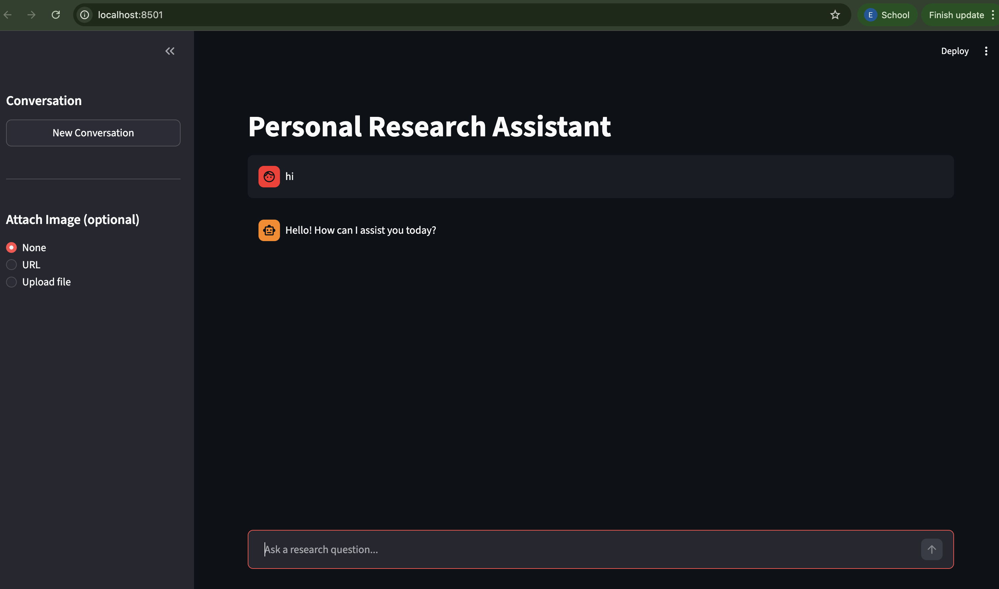

# Yelnar's Assistant

An AI research assistant with a Streamlit chat UI and FastAPI backend, powered by LangGraph and Tavily search.



## Live Demo

**https://streamlit-production-868c.up.railway.app**

Deployed on Railway as two services — Streamlit (public) and FastAPI (private internal network). The FastAPI backend is not publicly exposed; Streamlit communicates with it via Railway's private networking.

## Features

- Web search via Tavily for real-time answers (news, weather, prices, current events)
- Multimodal support — attach images by URL or file upload
- Short-term memory per conversation thread
- Streamlit chat UI + FastAPI backend running together

## Project Structure

```
personal_chef/
├── src/
│   ├── agent/
│   │   ├── state.py        # ResearchState TypedDict
│   │   └── graph.py        # ReAct LangGraph agent
│   ├── tools/
│   │   └── search.py       # Tavily search tool
│   └── utils/
│       └── multimodal.py   # Image message builders
├── app.py                  # Streamlit chat UI
├── server.py               # FastAPI server
├── run.py                  # Launcher — starts both servers
├── main.py                 # CLI entry point (alternative)
├── .env.example            # API key template
└── pyproject.toml
```

## Setup

**1. Clone and enter the project**

```bash
git clone https://github.com/Yelekeee/personal-chef.git
cd personal-chef
```

**2. Copy the environment template and fill in your API keys**

```bash
cp .env.example .env
```

Open `.env` and set:
- `OPENAI_API_KEY` — from https://platform.openai.com
- `TAVILY_API_KEY` — from https://tavily.com

**3. Install dependencies**

```bash
uv sync
```

## Running

### Web UI (recommended)

Starts both FastAPI (port 8000) and Streamlit (port 8501) with one command:

```bash
uv run python run.py
```

Then open http://localhost:8501 in your browser.

### API only

```bash
uv run python server.py
```

API docs available at http://localhost:8000/docs.

### CLI (alternative)

```bash
uv run python main.py
```

#### CLI Commands

| Command | Description |
|---|---|
| `<question>` | Ask any research question |
| `/image-url` | Attach a remote image by URL |
| `/image-file` | Attach a local image file |
| `/new` | Start a fresh conversation |
| `/help` | Show help text |
| `/quit` | Exit |
